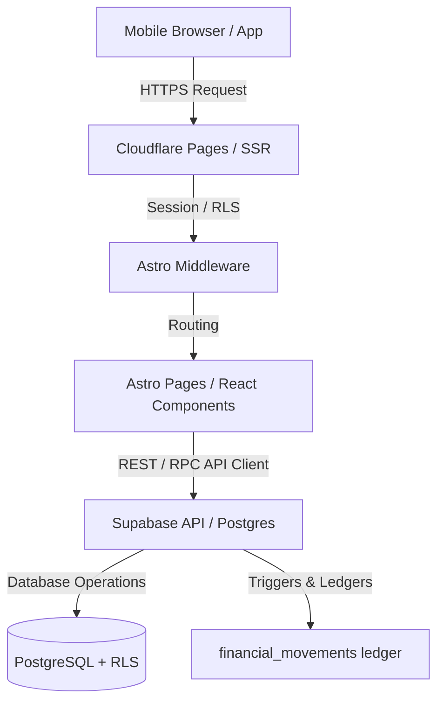

# Architecture & Patterns — VTC HUB

This document details the architectural layout, system design, data flow, and core design patterns of VTC HUB.

## 🏛️ Architecture Overview
VTC HUB is built as a highly performant, multi-tenant VTC SaaS platform leveraging **Astro** for server-side rendering (SSR), hosted on **Cloudflare Pages**, and backed by **Supabase**.

## 🛠️ Multi-Tenancy Architecture
- **Tenant Isolation** : Every critical table contains a `tenant_id` field.
- **Row-Level Security (RLS)** : Enforced directly at the database level. Queries without matching auth credentials will automatically fail.
- **Onboarding Pipeline** : Unified onboarding stage requiring SIRET validation, KBIS upload, and manual admin verification before the tenant profile shifts to approved.

## 🔄 Core Data Flows

### 1. Booking (Ride) Lifecycle
1. **Creation** : Client inputs pickup/dropoff details. System performs pricing calculations on server. Booking is logged as `to_validate`.
2. **Acceptance** : Owner/driver accepts booking; status moves to `not_started`.
3. **Execution** : Driver triggers states `in_progress` -> `completed` (restricted to H-15 time boundary).
4. **Settlement** : Financial movement logged to immutable ledger; QR code for reviews is generated.

### 2. Financial Auditing (Grand Livre Ledger)
- Payments, adjustments, and refunds are committed directly to `financial_movements` as immutable insert-only records.
- Triggers guard booking fields (`total_amount`, `pickup_time`) to prevent modification post-validation.

## 🚦 Entry Points & Routing
- **Middleware (`src/middleware.ts`)** : Intercepts all requests, parses Auth cookies, validates tenant access, and checks session inactivity.
- **Client App Dashboard (`src/pages/app/dashboard.astro`)** : Central mobile command center for VTC drivers.
- **Customer Reservation (`src/pages/index.astro`)** : Entry point for riders booking a trip.
- **Admin Dashboard (`src/pages/admin/dashboard.astro`)** : Centralized verification portal for validating tenants.
