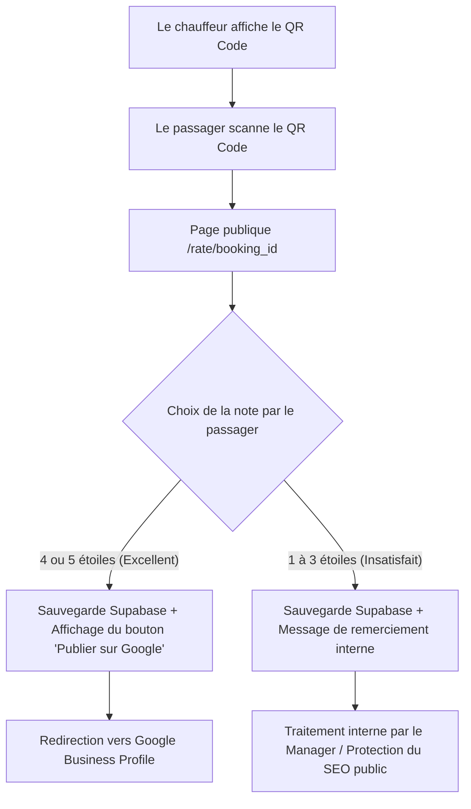

# ⭐ QR Code Ratings & Smart Feedback Routing

## Goal

Permettre l'évaluation instantanée des missions par les passagers via un QR code affiché sur l'appareil du chauffeur, avec un système d'aiguillage intelligent protégeant l'e-réputation tout en maximisant le SEO local sur Google.

---

## ⚙️ Technical Stack

- **Library**: `qrcode` (NPM package utilisé en Vanilla JS pour générer le code hors-ligne).
- **Target URL**: `https://[domain]/rate/[booking_id]` (publique et minimaliste).
- **Redirection**: Google Business Profile Reviews URL (stocké dans `tenants.google_reviews_url`).

---

## 🚀 Workflows & Smart Routing



### 1. Driver Workflow (App & Dashboard)
- **Condition** : La course doit être en statut `completed`.
- **Action** : Le bouton "Avis Passager (QR Code)" s'affiche dans les détails de la course (`#booking-modal` et `#detail-booking-modal`).
- **Génération** : Le script client utilise `qrcode` pour dessiner localement le QR code sur un élément `<canvas>` :
  ```javascript
  import QRCode from 'qrcode';
  QRCode.toCanvas(canvasElement, ratingUrl);
  ```

### 2. Passenger Workflow (Public Rating Page)
- **Accès** : Scan du QR Code menant à `/rate/[booking_id]`.
- **Interface** :
  - Sélecteur d'étoiles (1 à 5).
  - Commentaire texte optionnel.
- **Soumission** :
  - Appel API POST vers `/api/submit-rating`.
  - Si la note est $\ge 4$ et qu'une URL Google Reviews est configurée pour l'entreprise, un écran de félicitations s'affiche avec un lien d'incitation à copier/publier l'avis sur Google.
  - Sinon, affichage d'un simple remerciement interne poli.

---

## 🗄️ Data Layer

- **`bookings` table** : Colonnes `rating` (smallint), `rating_comment` (text) et `rating_created_at` (timestamp).
- **`tenants` table** : Colonne `google_reviews_url` (text) contenant le lien direct d'avis Google de la compagnie.
- **`driver_ratings` View** : Agrège les notes moyennes et le volume d'avis par chauffeur/entreprise.
